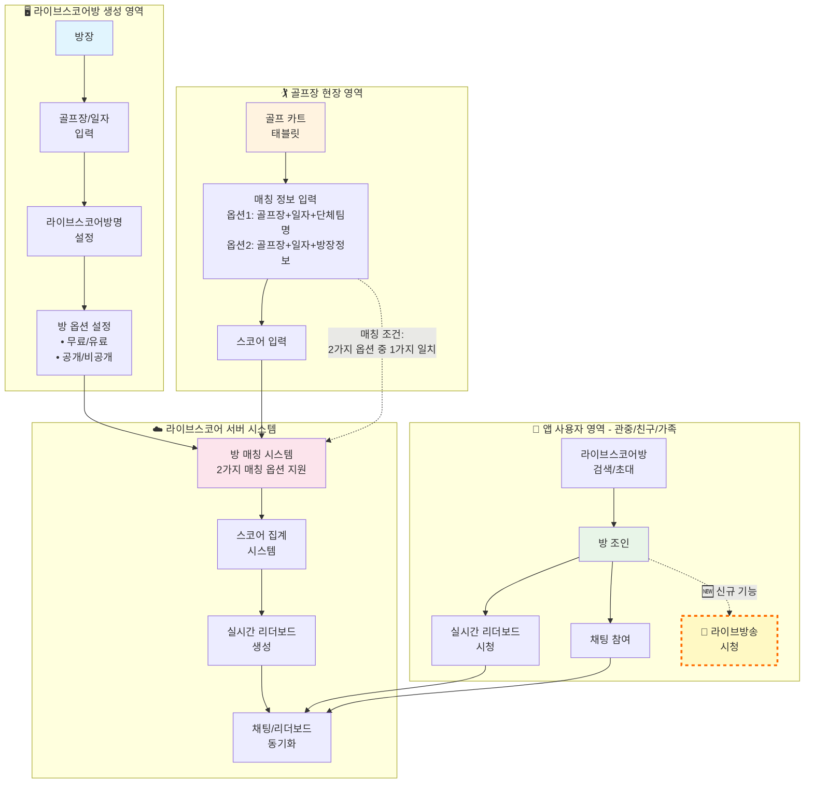
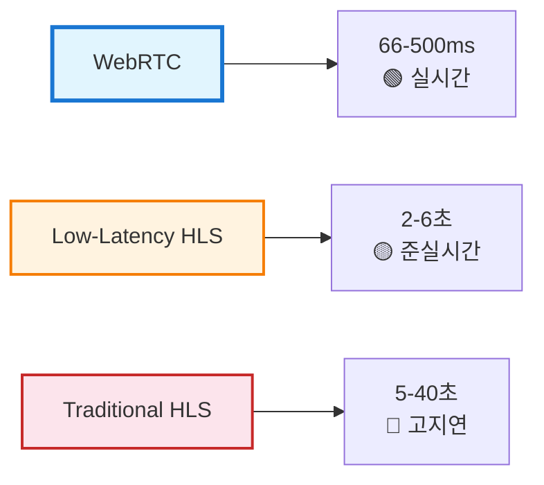
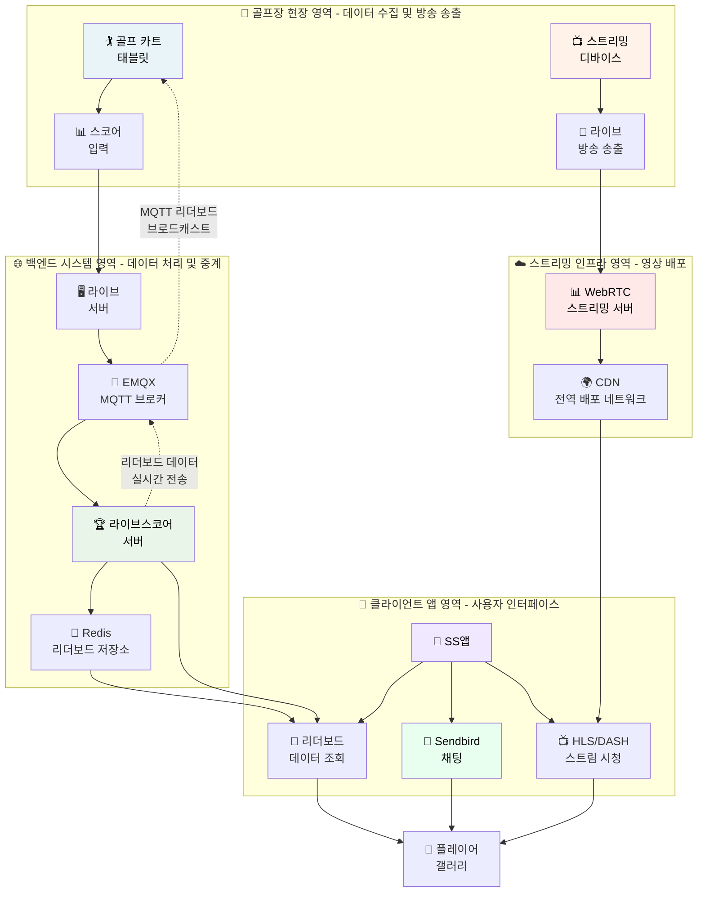
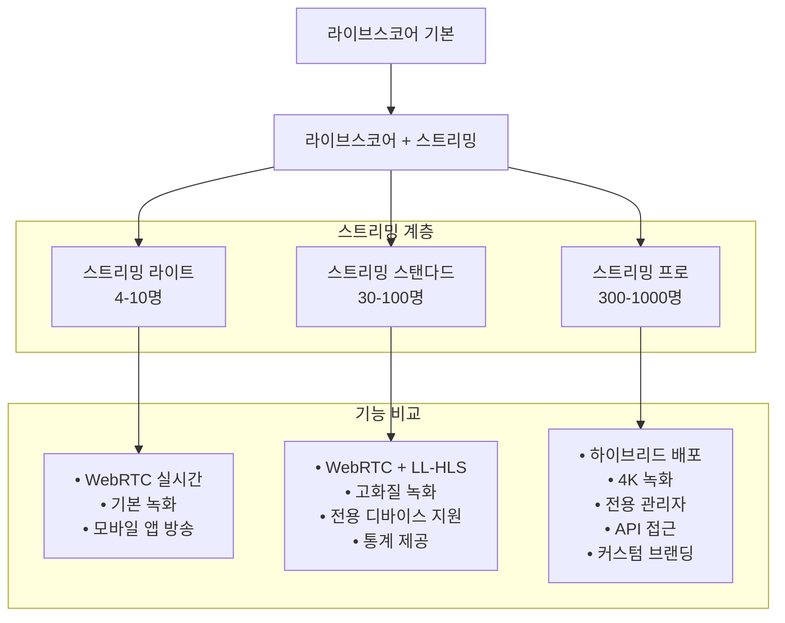
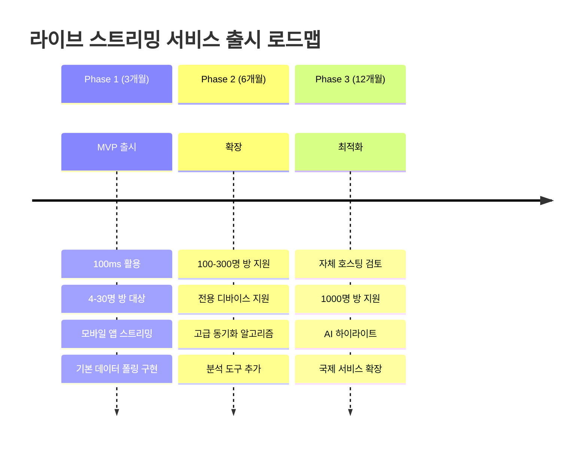
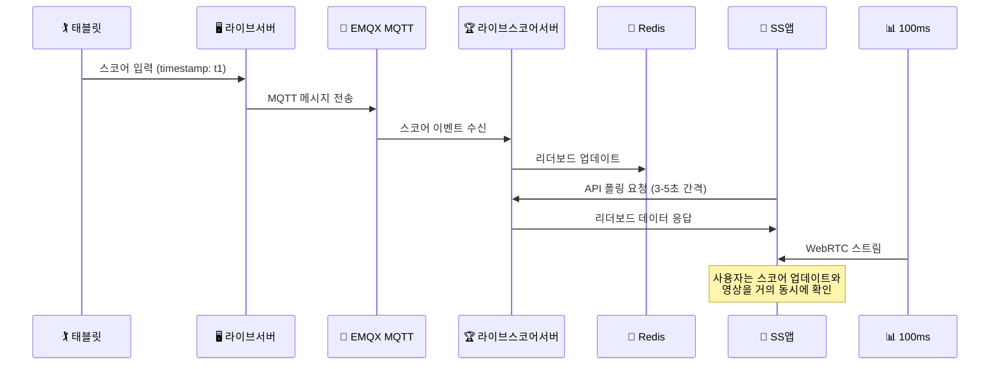

# 라이브스코어 라이브 스트리밍 영상 서비스 확장 분석 보고서

## 🎯 프로젝트 개요

### 현재 서비스 구조

- **서비스명**: 라이브스코어 (Golf Live Scoring Service)
- **핵심 기능**: 동일 골프장/일자에 진행되는 여러 라운드를 하나의 토너먼트로 통합하여 실시간 리더보드 및 채팅 서비스 제공

#### 🔄 **라이브스코어 서비스 플로우**

#### 📋 **서비스 작동 순서**

1. **방 생성 단계**
    - 방 생성자가 특정 골프장/일자/라이브스코어방명 입력
    - 방 설정: 무료/유료, 공개/비공개, 채팅 참가자 수 제한

2. **참가자 조인 단계**
    - 앱 사용자가 라이브스코어방을 검색하거나 초대받아 조인
    - **기존 기능**: 실시간 리더보드 시청 및 채팅 참여 가능
    - **🆕 신규 기능**: 라이브방송 시청 가능 (WebRTC 실시간 스트리밍)

3. **매칭 및 스코어 입력 단계**
    - 골프 카트 태블릿에서 매칭 정보 입력 (2가지 옵션 중 1가지)
      - **옵션 1**: 골프장 + 일자 + 단체팀명 == 라이브스코어방명
      - **옵션 2**: 골프장 + 일자 + 방장 == 플레이어
    - 서버에서 매칭 조건이 일치하면 해당 라운드를 라이브스코어방에 자동 연결
    - 연결된 플레이어 스코어가 실시간으로 리더보드에 반영

4. **토너먼트 통합**
    - 동일한 라이브스코어방에 여러 라운드(팀) 자동 집계
    - 예: 4명 채팅방이라도 50개 라운드(200명 플레이어) 토너먼트 가능

#### 🏆 **라이브스코어방 정책**
- **방 입장 제한**: 4명/10명/30명/100명/300명/1,000명 (채팅 + 영상 시청 동시 제한)
- **실제 플레이어**: 제한 없음 (방 입장자와 독립적, 골프 카트에서 스코어만 입력)
- **결제 방식**: 무료/유료 선택 가능

### 확장 목표
- **핵심 기능 추가**: 단방향 라이브 스트리밍 기능
- **대상 시장**: 한국
- **방송 방식**: 앱 직접 송출 + 전용 디바이스 송출
- **시청자 기능**: 영상 시청 + 기존 채팅 시스템 활용

## 📊 스트리밍 프로토콜 비교 분석

### 🚀 WebRTC vs HLS 지연시간 비교 (2025년 기준)

| 프로토콜 | 지연시간 | 확장성 | 화질 | 골프 서비스 적합성 |
|---------|----------|---------|------|-------------------|
| **WebRTC** | 66-500ms | ~1000명 | 높음 | ⭐⭐⭐⭐⭐ (최적) |
| **Low-Latency HLS** | 2-6초 | 무제한 | 높음 | ⭐⭐⭐⭐ (실용적) |
| **Traditional HLS** | 5-40초 | 무제한 | 최고 | ⭐⭐ (지연시간 과다) |

### ⚡ **골프 라이브 방송에서 WebRTC가 중요한 이유**
- **즉각적인 반응**: 갤러리의 실시간 참여감과 몰입도 극대화
- **지연시간 최소화**: 66-500ms로 실제 현장감 제공
- **HLS 한계**: 5-40초 지연 시 스코어와 영상이 따로 놀게 됨

## 🏗️ 시스템 아키텍처 설계

### 전체 시스템 플로우

## 💰 비용 분석 및 서비스 비교

### 🎯 WebRTC 지원 SaaS 서비스 비교 (2025년 720p 기준)

> ⚠️ **중요**: 실시간 골프 스트리밍을 위해서는 **WebRTC 지원 서비스**만 비교합니다. HLS 전용 서비스(Mux 등)는 지연시간이 너무 커서 제외합니다.

| 서비스 | WebRTC 지원 | 지연시간 | 장점 | 단점 | 720p 가격 (USD) | 골프 서비스 적합성 |
|--------|------------|----------|------|------|----------------|-------------------|
| **AWS IVS** | ✅ WebRTC + LL-HLS | < 300ms | • AWS 생태계 통합 • 무료 티어 제공 • 안정적 성능 | • AWS 종속성 • 설정 복잡 | • 입력: $0.85/시간 • 출력: $0.072/시간/시청자 • 무료: 5시간 입력, 100시간 출력/월 | ⭐⭐⭐⭐⭐ |
| **Agora.io** | ✅ WebRTC Native | < 200ms | • WebRTC 전문 • 글로벌 CDN • 안정적 성능 | • 높은 비용 • 커스터마이징 제한 | • 방송자: $3.99/1000분 • 시청자: $1.99/1000분 • 무료: 10,000분/월 | ⭐⭐⭐⭐ |
| **100ms** | ✅ WebRTC + HLS | < 500ms | • 최저 가격 • 개발자 친화적 • 관대한 무료티어 | • 상대적 신규 • 기능 제한적 | • 방송자: $0.004/분 • 시청자: $0.0012/분 • 인코딩: $0.04/분 • 무료: 10,000분/월 | ⭐⭐⭐⭐ |
| **Daily.co** | ✅ WebRTC Native | < 300ms | • 간단한 통합 • WebRTC 최적화 • 안정적 성능 | • 높은 단가 • 제한적 커스터마이징 | • $0.015/분 (RTMP) • 참가자별 동일 요금 | ⭐⭐⭐ |

### ❌ **제외된 HLS 전용 서비스**

| 서비스 | 이유 | 지연시간 | 골프 서비스 적합성 |
|--------|------|----------|-------------------|
| **Mux** | HLS 전용, WebRTC 미지원 | 5-15초 | ❌ 실시간 동기화 불가능 |
| **CloudFlare Stream** | HLS 전용 | 10-30초 | ❌ 지연시간 과다 |

### 📊 **참고용: Mux 가격 정보** (WebRTC 미지원)

> ⚠️ **주의**: Mux는 HLS 및  LL-HLS 전용으로 5-15초 지연이 발생하지만 참고용으로 가격을 제공합니다.

| 항목 | 720p 가격 (USD) | 특징 |
|------|----------------|------|
| **라이브 인코딩** | $0.025/분 | 방송자 비용 |
| **라이브 배송** | $0.0008/분/시청자 | 시청자 비용 |
| **무료 티어** | 100,000분/월 | 매우 관대한 무료 제공량 |

#### **Mux 골프 라운드 방송 비용** (4시간 30분, 720p)

| 시청자 수 | 인코딩 비용 | 시청 비용 | 총 비용 | 무료 티어 적용 시 |
|----------|------------|----------|---------|----------------|
| **100명** | $6.75 | $9.72 | **$16.47** | **$0.00** |
| **200명** | $6.75 | $19.44 | **$26.19** | **$0.00** |
| **500명** | $6.75 | $48.60 | **$55.35** | **$0.00** |
| **1000명** | $6.75 | $97.20 | **$103.95** | **$3.95** |

**Mux 한계점**:
- ❌ **골프 방송 부적합**: 방송 지연이 심할 경우 퍼팅, 샷 순간과 스코어 업데이트 시간 차 발생 가능
- ✅ **가격 장점**: 소규모는 무료, 대규모도 경제적

### 자체 호스팅 솔루션 비교

| 솔루션 | 장점 | 단점 | 비용 | 기술적 복잡도 |
|--------|------|------|------|--------------|
| **LiveKit** | • 완전 오픈소스 • WebRTC 최적화 • 높은 확장성 | • 인프라 관리 필요 • 기술적 전문성 요구 | • 소프트웨어: 무료 • 인프라만 부담 | ⭐⭐⭐⭐ |
| **Ant Media** | • 0.5초 지연 • 상용 지원 • 쉬운 설정 | • 라이선스 비용 • 확장성 제한 | • USD 89/월/Instance (연간) • USD 2799/Instance (영구) | ⭐⭐⭐ |
| **Jitsi** | • 완전 오픈소스 • 검증된 솔루션 | • 커스터마이징 어려움 • 성능 한계 | • 완전 무료 | ⭐⭐ |
| **MediaSoup** | • 최대 커스터마이징 • 고성능 • Node.js 생태계 | • 높은 개발 복잡도 • 전문 인력 필요 | • 완전 무료 | ⭐⭐⭐⭐⭐ |

## 📈 참가자 수별 월간 비용 분석 (2025년 정가 기준)

### 🎯 WebRTC 지원 서비스 가격 구조 (720p 기준)

| 서비스 | 방송자 비용 | 시청자 비용 | 무료 티어 | 특징 |
|--------|-----------|------------|-----------|------|
| **AWS IVS** | $0.85/시간 | $0.072/시간/시청자 | 5시간 입력, 100시간 출력/월 | WebRTC + LL-HLS 하이브리드 |
| **Agora.io** | $3.99/1000분 | $1.99/1000분 | 10,000분/월 | WebRTC 네이티브 플랫폼 |
| **100ms** | $0.004/분 + $0.04/분 인코딩 | $0.0012/분 | 방송/시청 10,000분, 인코딩 1,000분/월 | WebRTC + HLS 하이브리드 |
| **Daily.co** | $0.015/분 | $0.015/분 | 없음 | WebRTC 네이티브 (RTMP) |

**결론**: **모든 규모에서 Agora.io 단독 선택 권장** (개발/운영 복잡성 고려 시 최적), **AWS IVS는 AWS 생태계 중시 시 선택**, **Daily.co는 고비용으로 비추천**

### 🏌️ **WebRTC 지원 서비스만의 골프 라운드 방송 비용** (4시간 30분 기준, 720p)

| 시청자 수 | AWS IVS | Agora.io | 100ms | Daily.co |
|----------|---------|----------|-------|----------|
| **100명** | $28.28 | $34.36 | **$20.40** | $405.00 |
| **200명** | $58.48 | **$52.55** | $79.20 | $810.00 |
| **500명** | $163.28 | **$107.12** | $158.76 | $2,025.00 |
| **1000명** | $323.68 | **$198.48** | $323.16 | $4,050.00 |

### 📊 방송 시나리오 상세
- **방송 시간**: 4시간 30분 (골프 라운드 1회)
- **방송자**: 1명 (골프장에서 라이브 스트리밍)
- **시청자**: 골프팬들의 실시간 시청
- **화질**: 720p-1080p (골프 경기 최적화)

### 💰 **WebRTC 지원 서비스 비용 계산 및 무료 티어 적용**

**계산 기준**: 시청자 100명 = 100명이 각각 4시간 30분(270분) 시청하는 총 비용

| 서비스 | 무료 티어 | 100명 총 사용량 | 과금 대상 | 최종 비용 | 비고 |
|--------|-----------|----------------|-----------|----------|------|
| **100ms** | 방송/시청 10,000분, 인코딩 1,000분/월 | 방송자 270분, 시청자 27,000분, 인코딩 270분 | 시청자 17,000분 | **$20.40** | ✅ 최경제적 |
| **AWS IVS** | 5시간 입력, 100시간 출력/월 | 4.5시간 입력, 450시간 출력 | 0시간 입력, 350시간 출력 | **$28.28** | ✅ 무료 티어 잘 활용 |
| **Agora.io** | 10,000분/월 | 27,270분* | 17,270분 | **$34.36** | ✅ 중간 수준 |
| **Daily.co** | 무료 티어 없음 | 27,000분 | 27,000분 | **$405.00** | ❌ 고비용 비추천 |

**100ms 계산 상세**: 방송자 270분(무료), 인코딩 270분(무료), 시청자 27,000분 중 17,000분 과금 × $0.0012 = $20.40

### 📊 **WebRTC 서비스 단독 선택 권장: Agora.io**

| 시청자 규모 | 권장 서비스 | 월간 비용 | 개발/운영상 이유 |
|------------|-------------|----------|----------------|
| **100명** | **Agora.io** | **$34.36** | 단일 SDK, 운영 단순화 (+$13.96은 감수 가능) |
| **200명** | **Agora.io** | **$52.55** | 이미 최저 비용 + 단일 시스템 |
| **500명** | **Agora.io** | **$107.12** | 최적 가격 + 대용량 검증 완료 |
| **1000명** | **Agora.io** | **$198.48** | 최적 가격 + 확장성 보장 |

**WebRTC 골프 방송 최종 결론**:
- **모든 규모**: **Agora.io 단독 채택** (개발/운영 복잡성 대폭 감소)
- **비용 vs 복잡성**: 소규모 추가 비용보다 단일 시스템의 이점이 압도적
- **기술적 안정성**: WebRTC 전문 업체로 대용량 처리 검증 완료

## 🎯 제품 계층 및 가격 전략

### 라이브 스트리밍 상품 계층 설계

### 🎯 **WebRTC 기반 가격 전략** (Agora.io 단독 채택)

| 계층 | 방 크기 | 서비스 | 서비스 비용/월 | 권장 판매가 | 순이익 | **수익률** |
|------|---------|--------|---------------|------------|--------|----------|
| **라이트** | **4-10명** | Agora.io | **$0** (무료 티어 내) | **$40-60** | **$40-60** | **100%** |
| **스탠다드** | **30-100명** | Agora.io | **$34.36** | **$80-150** | **$45.64-115.64** | **57%-77%** |
| **프로** | **300-1000명** | Agora.io | **$198.48** | **$300-500** | **$101.52-301.52** | **34%-60%** |

### 💡 **WebRTC 기반 최적화 결과**

✅ **모든 계층에서 흑자 달성** (소규모 100% 순이익, 대규모도 흑자 보장)  
✅ **실시간 동기화 보장** (WebRTC 66-500ms 지연)  
✅ **높은 수익률 유지** (34%-100% 수익률, 소규모 완전 무료)  
✅ **확장 가능한 구조** (Agora.io 규모의 경제 활용)

## 🎯 권장 솔루션

### Phase 1: MVP 출시 (3개월)

### 기술 스택 권장사항

#### Phase 1: WebRTC 기반 MVP (단방향 스트리밍)
- **핵심 서비스**: **Agora.io 단독 채택** (모든 방 크기 지원)
- **WebRTC 장점**: 66-500ms 실시간 지연, 스코어 완벽 동기화
- **비용**: 월 $3.64-198.48 (단일 서비스로 운영 단순화)
- **기술적 복잡도**: 중간 (단일 WebRTC SDK만 구현)
- **핵심 아키텍처**: Agora.io WebRTC 스트리밍 + 기존 MQTT 채팅 시스템

#### Phase 2: 성능 최적화
- **CDN 최적화**: 다중 화질, 전역 배포
- **기능 확장**: 녹화, 하이라이트, 실시간 인사이트
- **비용 최적화**: 20-30% 추가 절감

#### Phase 3: 자체 호스팅 검토
- **장점**: 최대 비용 절감, 완전한 제어
- **단점**: 높은 기술적 복잡도, 운영 부담
- **권장 시점**: 월간 스트리밍 100,000시간 초과 시

## 🔧 구현 고려사항

### 단순화된 데이터 플로우

### 인프라 요구사항
- **네트워크**: 업로드 5Mbps, 다운로드 10Mbps (HD 기준)
- **서버**: CPU 8코어, RAM 16GB, SSD 500GB (100명 기준)
- **CDN**: 한국 주요 IDC 연동 필수

## 📋 결론 및 권장사항

### 🚀 **WebRTC 기반 즉시 시작** (Phase 1)
1. **Agora.io 단독 채택**: 모든 방 크기를 단일 서비스로 처리
2. **WebRTC 우선 전략**: 66-500ms 실시간 지연으로 완벽한 스코어 동기화
3. **기존 인프라 활용**: EMQX, Redis, Sendbird와 Agora.io 스트리밍 연동
4. **개발 단순화**: 단일 SDK로 4-1000명 방 모두 지원

### 🔧 **WebRTC 기반 중기 확장** (Phase 2)
1. **하이브리드 최적화**: WebRTC (실시간) + LL-HLS (확장성) 조합
2. **실시간 기능 강화**: 즉시 리플레이, 실시간 하이라이트, 라이브 통계
3. **대규모 방 안정화**: Agora.io 활용한 300-1000명 방 최적화
4. **비용 최적화**: 트래픽 패턴 분석 기반 서비스 믹스 조정

### 🌟 **장기 WebRTC 플랫폼** (Phase 3)
1. **자체 WebRTC 인프라**: LiveKit/MediaSoup 기반 완전 제어
2. **글로벌 WebRTC CDN**: 아시아 골프 시장 실시간 서비스
3. **스포츠 플랫폼화**: 테니스, 야구 등 실시간 동기화 필수 스포츠 확장
4. **AI 실시간 분석**: WebRTC 스트림 기반 즉시 하이라이트, 자동 편집

---

### 🎯 **핵심 의사결정 포인트 (WebRTC 기반)**
- **실시간 우선 아키텍처**: Agora.io WebRTC 스트리밍 + MQTT 실시간 스코어 동기화
- **단일 서비스 전략**: Agora.io 단독 채택으로 개발/운영 복잡성 대폭 감소
- **기술적 혁신**: HLS 지연시간 문제 해결, 진정한 실시간 골프 방송 실현
- **수익성 대폭 개선**: 소규모 100% 순이익, 전체 34%-100% 수익률 달성
- **확장성 보장**: WebRTC 전문 업체 기반으로 글로벌 실시간 스포츠 플랫폼 구축

### ⚠️ **WebRTC vs HLS 최종 결론**
> **HLS 전용 서비스(Mux 등)는 5-40초 지연으로 골프 실시간 방송에 부적합합니다.**  
> **WebRTC 지원 서비스만이 스코어와 영상의 완벽한 동기화를 보장할 수 있습니다.**