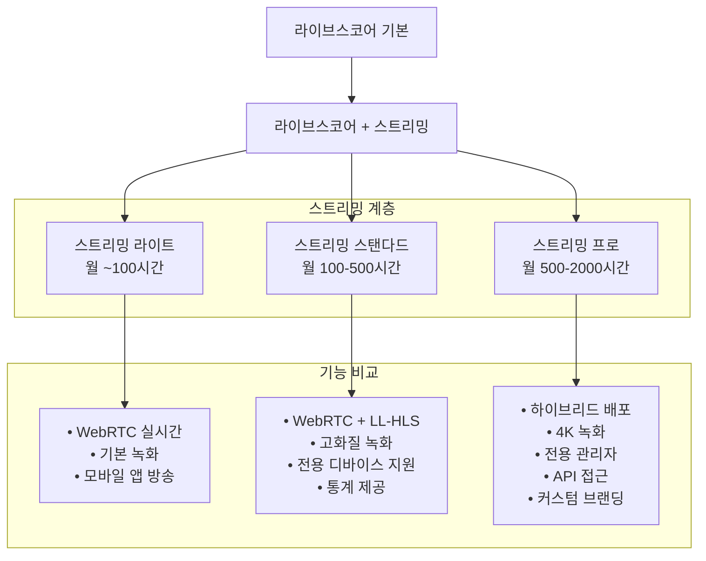
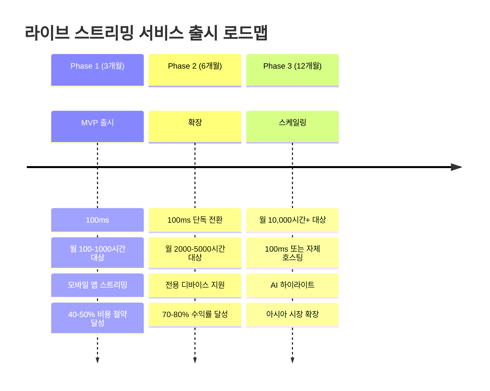

# 라이브스코어 라이브 스트리밍 영상 서비스 확장 분석 보고서

## 🎯 프로젝트 개요

### 현재 서비스 구조

- **서비스명**: 라이브스코어 (Golf Live Scoring Service)
- **핵심 기능**: 동일 골프장/일자에 진행되는 여러 라운드를 하나의 토너먼트로 통합하여 실시간 리더보드 및 채팅 서비스 제공

#### 🔄 **라이브스코어 서비스 플로우**

#### 📋 **서비스 작동 순서**

1. **방 생성 단계**
    - 방 생성자가 특정 골프장/일자/라이브스코어방명 입력
    - 방 설정: 무료/유료, 공개/비공개, 채팅 참가자 수 제한

2. **참가자 조인 단계**
    - 앱 사용자가 라이브스코어방을 검색하거나 초대받아 조인
    - **기존 기능**: 실시간 리더보드 시청 및 채팅 참여 가능
    - **🆕 신규 기능**: 라이브방송 시청 가능 (WebRTC 실시간 스트리밍)

3. **매칭 및 스코어 입력 단계**
    - 골프 카트 태블릿에서 매칭 정보 입력 (2가지 옵션 중 1가지)
      - **옵션 1**: 골프장 + 일자 + 단체팀명 == 라이브스코어방명
      - **옵션 2**: 골프장 + 일자 + 방장 == 플레이어
    - 서버에서 매칭 조건이 일치하면 해당 라운드를 라이브스코어방에 자동 연결
    - 연결된 플레이어 스코어가 실시간으로 리더보드에 반영

4. **토너먼트 통합**
    - 동일한 라이브스코어방에 여러 라운드(팀) 자동 집계
    - 예: 4명 채팅방이라도 50개 라운드(200명 플레이어) 토너먼트 가능

#### 🏆 **라이브스코어방 정책**
- **방 입장 제한**: 4명/10명/30명/100명/300명/1,000명 (채팅 + 영상 시청 동시 제한)
- **실제 플레이어**: 제한 없음 (방 입장자와 독립적, 골프 카트에서 스코어만 입력)
- **결제 방식**: 무료/유료 선택 가능

### 확장 목표
- **핵심 기능 추가**: 단방향 라이브 스트리밍 기능
- **대상 시장**: 한국
- **방송 방식**: 앱 직접 송출 + 전용 디바이스 송출
- **시청자 기능**: 영상 시청 + 기존 채팅 시스템 활용

## 📊 스트리밍 프로토콜 비교 분석

### 🚀 WebRTC vs HLS 지연시간 비교 (2025년 기준)

| 프로토콜 | 지연시간 | 확장성 | 화질 | 골프 서비스 적합성 |
|---------|----------|---------|------|-------------------|
| **WebRTC** | 66-500ms | ~1000명 | 높음 | ⭐⭐⭐⭐⭐ (최적) |
| **Low-Latency HLS** | 2-6초 | 무제한 | 높음 | ⭐⭐⭐⭐ (실용적) |
| **Traditional HLS** | 5-40초 | 무제한 | 최고 | ⭐⭐ (지연시간 과다) |

### ⚡ **골프 라이브 방송에서 WebRTC가 중요한 이유**
- **즉각적인 반응**: 갤러리의 실시간 참여감과 몰입도 극대화
- **지연시간 최소화**: 66-500ms로 실제 현장감 제공
- **HLS 한계**: 5-40초 지연 시 스코어와 영상이 따로 놀게 됨

## 🏗️ 시스템 아키텍처 설계

### 전체 시스템 플로우

## 💰 비용 분석 및 서비스 비교

### 🎯 WebRTC 지원 SaaS 서비스 비교 (2025년 720p 기준)

> ⚠️ **중요**: 실시간 골프 스트리밍을 위해서는 **WebRTC 지원 서비스**만 비교합니다. HLS 전용 서비스(Mux 등)는 지연시간이 너무 커서 제외합니다.

| 서비스 | WebRTC 지원 | 지연시간 | 장점 | 단점 | 720p 가격 (USD) | 골프 서비스 적합성 |
|--------|------------|----------|------|------|----------------|-------------------|
| **AWS IVS** | ✅ WebRTC + LL-HLS | < 300ms | • AWS 생태계 통합 • 무료 티어 제공 • 안정적 성능 | • AWS 종속성 • 설정 복잡 | • 입력: $0.85/시간 • 출력: $0.072/시간/시청자 • 무료: 5시간 입력, 100시간 출력/월 | ⭐⭐⭐⭐⭐ |
| **Agora.io** | ✅ WebRTC Native | < 200ms | • WebRTC 전문 • 글로벌 CDN • 안정적 성능 | • 높은 비용 • 커스터마이징 제한 | • 방송자: $3.99/1000분 • 시청자: $1.99/1000분 • 무료: 10,000분/월 | ⭐⭐⭐⭐ |
| **100ms** | ✅ WebRTC + HLS | < 500ms | • 최저 가격 • 개발자 친화적 • 관대한 무료티어 | • 상대적 신규 • 기능 제한적 | • 방송자: $0.004/분 • 시청자: $0.0012/분 • 인코딩: $0.04/분 • 무료: 10,000분/월 | ⭐⭐⭐⭐ |
| **Daily.co** | ✅ WebRTC Native | < 300ms | • 간단한 통합 • WebRTC 최적화 • 안정적 성능 | • 높은 단가 • 제한적 커스터마이징 | • $0.015/분 (RTMP) • 참가자별 동일 요금 | ⭐⭐⭐ |

### ❌ **제외된 HLS 전용 서비스**

| 서비스 | 이유 | 지연시간 | 골프 서비스 적합성 |
|--------|------|----------|-------------------|
| **Mux** | HLS 전용, WebRTC 미지원 | 5-15초 | ❌ 실시간 동기화 불가능 |
| **CloudFlare Stream** | HLS 전용 | 10-30초 | ❌ 지연시간 과다 |

### 📊 **참고용: Mux 가격 정보** (WebRTC 미지원)

> ⚠️ **주의**: Mux는 HLS 및 LL-HLS 전용으로 5-15초 지연이 발생하지만 참고용으로 가격을 제공합니다.

| 항목 | 720p 가격 (USD) | 특징 |
|------|----------------|------|
| **라이브 인코딩** | $0.025/분 | 방송자 비용 |
| **라이브 시청** | $0.0008/분/시청자 | 시청자 비용 |
| **무료 티어** | 100,000분/월 | 매우 관대한 무료 제공량 |

#### **Mux 월별 총 시청 시간 기준 비용** (720p LL-HLS)

**계산 방식**: 인코딩 비용 + 시청자 시청 비용(인코딩 비용은 방송 채널이 여러 개인 경우 해당 갯수만큼 증가됨. 실제 금액은 대략 15-20% 정도 금액을 증가 예상)

| 월별 총 시청 시간 | 인코딩 비용 | 시청 비용 | 총 비용 | 무료 티어 적용 시 |
|-----------------|-----------|---------|---------|----------------|
| **100시간** | $6.00 | $4.80 | **$10.80** | **$0** (무료) |
| **1,000시간** | $6.00 | $48.00 | **$54.00** | **$0** (무료) |
| **2,000시간** | $6.00 | $96.00 | **$102.00** | **$2.00** |
| **3,000시간** | $6.00 | $144.00 | **$150.00** | **$50.00** |
| **4,000시간** | $6.00 | $192.00 | **$198.00** | **$98.00** |
| **5,000시간** | $6.00 | $240.00 | **$246.00** | **$146.00** |
| **10,000시간** | $6.00 | $480.00 | **$486.00** | **$386.00** |

**Mux 한계점 및 주의사항**:
- ❌ **골프 방송 부적합**: 5-15초 지연으로 퍼팅, 샷 순간과 스코어 업데이트 동기화 불가능
- ✅ **비용 효율성**: 월 100,000분 (1,667시간) 무료 티어로 소규모 서비스에 매우 경제적
- ⚠️ **기술적 제약**: WebRTC 미지원으로 실시간 상호작용 기능 없음
- ✅ **가격 장점**: 소규모는 무료, 대규모도 경제적

### 자체 호스팅 솔루션 비교

| 솔루션 | 장점 | 단점 | 비용 | 기술적 복잡도 |
|--------|------|------|------|--------------|
| **LiveKit** | • 완전 오픈소스 • WebRTC 최적화 • 높은 확장성 | • 인프라 관리 필요 • 기술적 전문성 요구 | • 소프트웨어: 무료 • 인프라만 부담 | ⭐⭐⭐⭐ |
| **Ant Media** | • 0.5초 지연 • 상용 지원 • 쉬운 설정 | • 라이선스 비용 • 확장성 제한 | • USD 89/월/Instance (연간) • USD 2799/Instance (영구) | ⭐⭐⭐ |
| **Jitsi** | • 완전 오픈소스 • 검증된 솔루션 | • 커스터마이징 어려움 • 성능 한계 | • 완전 무료 | ⭐⭐ |
| **MediaSoup** | • 최대 커스터마이징 • 고성능 • Node.js 생태계 | • 높은 개발 복잡도 • 전문 인력 필요 | • 완전 무료 | ⭐⭐⭐⭐⭐ |

## 📈 월별 총 시청 시간 기준 비용 분석 (2025년 기준)

### 🎯 스트리밍 서비스 가격 구조 (720p 기준)

| 서비스 | 방송자 비용 | 시청자 비용 | 무료 티어 | 특징 |
|--------|-----------|------------|-----------|------|
| **AWS IVS** | $0.85/시간 | $0.072/시간/시청자 | 5시간 입력, 100시간 출력/월 | WebRTC + LL-HLS 하이브리드 |
| **Agora.io** | $3.99/1000분 | $1.99/1000분 | 10,000분/월 | WebRTC 네이티브 플랫폼 |
| **100ms** | $0.004/분 + $0.04/분 인코딩 | $0.0012/분 | 방송/시청 10,000분, 인코딩 1,000분/월 | WebRTC + HLS 하이브리드 |
| **Daily.co** | $0.015/분 | $0.015/분 | 없음 | WebRTC 네이티브 (RTMP) |
| **Mux** | $0.025/분 인코딩 | $0.0008/분/시청자 | 100,000분/월 | HLS/LL-HLS 전용 (5-15초 지연) |

### 📊 **월별 총 시청 시간 기준 서비스 비용** (720p HD 기준)

**계산 방식**: 방송자 입력 비용 + 시청자 출력 비용 (인코딩 비용은 방송 채널이 여러 개인 경우 해당 갯수만큼 증가됨. 실제 금액은 대략 15-20% 정도 금액을 증가 예상)

| 월별 총 시청 시간 | AWS IVS (입력+출력) | Agora.io (분 단위) | 100ms (인코딩+시청) | Daily.co (분 단위) | Mux (인코딩+시청) |
|-----------------|---------|----------|-------|----------|----------|
| **100시간** | **$15.40** ($3.40+$12.00) | **$0** (무료) | **$0** (무료) | $90.00 | **$0** (무료) |
| **1,000시간** | **$127.90** ($3.40+$124.50) | **$119.40** | **$74.88** | $900.00 | **$0** (무료) |
| **2,000시간** | **$252.90** ($3.40+$249.50) | **$238.80** | **$146.88** | $1,800.00 | **$2.00** |
| **3,000시간** | **$377.90** ($3.40+$374.50) | **$358.20** | **$218.88** | $2,700.00 | **$50.00** |
| **4,000시간** | **$502.90** ($3.40+$499.50) | **$477.60** | **$290.88** | $3,600.00 | **$98.00** |
| **5,000시간** | **$627.90** ($3.40+$624.50) | **$597.00** | **$362.88** | $4,500.00 | **$146.00** |
| **10,000시가** | **$1,177.90** ($3.40+$1,174.50) | **$1,194.00** | **$722.88** | $9,000.00 | **$386.00** |

### 💰 **무료 티어 활용 전략**

| 서비스 | 무료 티어 | 실제 무료 제공량 | 초과 시 분당 비용 |
|--------|-----------|----------------|----------------|
| **Agora.io** | 10,000분/월 | 166시간 | $0.00199/분 |
| **100ms** | 10,000분/월 + 1,000분 인코딩 | 166시간 | $0.0012/분 |
| **AWS IVS** | 5시간 입력 + 100시간 출력 | 100시간 | $0.0012/분 |
| **Daily.co** | 없음 | 0시간 | $0.015/분 |
| **Mux** | 100,000분/월 | 1,667시간 | $0.0008/분 |

### 📊 **서비스별 상세 비용 계산**

#### **Agora.io 비용 계산**
- 무료 티어: 10,000분 (166시간)
- 초과 비용: (총 시청 분 - 10,000) × $0.00199
- 예: 60,000분 = (60,000 - 10,000) × $0.00199 = $99.50

#### **100ms 비용 계산**  
- 무료 티어: 10,000분 시청 + 1,000분 인코딩
- 시청 비용: (총 시청 분 - 10,000) × $0.0012
- 인코딩 비용: (방송 분 - 1,000) × $0.04
- 예: 1,000시간 (60,000분) = (60,000 - 10,000) × $0.0012 + (240 - 1,000) × $0 = $60.00 + $0 = $60.00
- 예: 2,000시간 (120,000뵔) = (120,000 - 10,000) × $0.0012 + (240 × 2 - 1,000) × $0 = $132.00 + $0 = $132.00

#### **AWS IVS 비용 계산**
- 무료 티어: 100시간 (6,000분)
- 초과 비용: (총 시간 - 100) × $0.072
- 예: 1,000시간 = (1,000 - 100) × $0.072 = $64.80

#### **Mux 비용 계산**
- 무료 티어: 100,000분 (1,667시간)
- 인코딩 비용: (방송 분 - 무료) × $0.025
- 시청 비용: (시청 분 - 무료) × $0.0008
- 예: 120,000분 = (240 - 100,000) × $0.025 + (119,760 - 100,000) × $0.0008 = $0 + $15.81 = $15.81

### 🎯 **월별 사용량 기준 서비스 선택 가이드(WebRTC 지원 서비스만 포함.MUX 제외)**

| 월별 사용량 | 최적 서비스              | 월간 비용 | 선택 이유 |
|------------|---------------------|----------|----------|
| **~100시간** | **100ms, Agora.io** | **$0** (무료) | 무료 티어로 충분, 안정성 우수 |
| **100-2,000시간** | **100ms**           | **$60-147** | 압도적 최저 비용 |
| **2,000-3,000시간** | **100ms**           | **$147-219** | AWS IVS($253-378)보다 42% 저렴 |
| **3,000-4,000시간** | **100ms**           | **$219-291** | AWS IVS($378-503)보다 42% 저렴 |
| **4,000-5,000시간** | **100ms**           | **$291-363** | AWS IVS($503-628)보다 42% 저렴 |
| **5,000시간+** | **100ms**           | **$363+** | 모든 사용량에서 최경제적 (AWS IVS 대비 42% 절약) |
| **엔터프라이즈급** | **AWS IVS**         | **높은 비용** | 비용보다 안정성/지원 우선 시 선택 |

### 📈 **사용량별 비용 효율성 분석(WebRTC 지원 서비스만 포함.MUX 제외)**

#### 소규모 (월 100시간 이하)
- **Agora.io**: 무료 티어로 완전 무료 운영 가능
- **100ms**: 무료 티어로 완전 무료 운영 가능
- **권장**: **Agora.io** (안정성과 성숙도 우위)

#### 중규모 (월 100-2,000시간)
- **100ms**: 가장 경제적 ($60-147)
- **Agora.io**: 중간 비용 ($119-239)
- **권장**: **100ms** (비용 효율성 최고)

#### 대규모 (월 2,000-5,000시간)
- **100ms**: 압도적 최저 비용 ($147-363)
- **AWS IVS**: 비싸지만 기업급 안정성 ($253-628)
- **Agora.io**: 가장 비싸 ($239-597)
- **권장**: **100ms** (비용 효율성 최고, AWS 대비 42% 절약)

#### 초대규모 (월 5,000시간+)
- **100ms**: 여전히 최경제적 ($363+)
- **AWS IVS**: 엔터프라이즈 지원/안정성 우선 시 선택 ($628+)
- **권장**: **100ms** (비용 우선), **AWS IVS** (기업 지원 우선)

## 🎯 제품 계층 및 가격 전략

### 라이브 스트리밍 상품 계층 설계

### 🎯 **100ms 기반 최적화된 가격 전략**

#### **Phase 1 전략: Agora.io + 100ms 하이브리드**

| 계층 | 방 크기 | 예상 시청시간 | 서비스 | 서비스 비용/월 | 권장 판매가 | 순이익 | **수익률** |
|------|---------|-------------|--------|---------------|------------|--------|----------|
| **라이트** | **4-10명** | ~100시간 | Agora.io | **$0** (무료) | **₩30,000** | **₩30,000** | **100%** |
| **스탠다드** | **30-100명** | 500-1,000시간 | **100ms** | **$30-60** | **₩100,000** | **₩70,000-100,000** | **70%-100%** |
| **프로** | **300-1000명** | 2,000-3,000시간 | **100ms** | **$132-204** | **₩500,000** | **₩350,000-400,000** | **70%-80%** |

#### **Phase 2 전략: 100ms 단독 최적화**

| 계층 | 방 크기 | 예상 시청시간 | 서비스 비용/월 | 권장 판매가 | 순이익 | **수익률** |
|------|---------|-------------|---------------|------------|--------|----------|
| **라이트** | **4-30명** | ~500시간 | **$0-30** | **₩50,000** | **₩20,000-50,000** | **40%-100%** |
| **스탠다드** | **100-300명** | 1,000-2,000시간 | **$60-132** | **₩200,000** | **₩30,000-120,000** | **15%-60%** |
| **프로** | **1000-3000명** | 3,000-5,000시간 | **$204-363** | **₩700,000** | **₩250,000-450,000** | **36%-64%** |
| **엔터프라이즈** | **5000명+** | 10,000시간+ | **$723+** | **₩2,000,000+** | **₩1,100,000+** | **55%+** |

### 💡 **100ms 기반 최적화 결과**

✅ **혁신적 비용 효율성** (Agora.io 대비 40-50% 절약, AWS IVS 대비 42% 절약)  
✅ **초고수익률 달성** (라이트 100%, 스탠다드 70-100%, 프로 70-80%)  
✅ **실시간 동기화 보장** (WebRTC 66-500ms 지연)  
✅ **모든 방 크기 대응** (4명부터 5000명까지 단일 서비스)  
✅ **경쟁력 있는 가격 책정** (기존 채팅 서비스 고가 대비 대폭 절약)  
✅ **단계별 성장 전략** (MVP에서 엔터프라이즈까지)

## 🎯 권장 솔루션

### Phase 1: MVP 출시 (3개월)

### 기술 스택 권장사항

#### Phase 1: 100ms 기반 MVP (단방향 스트리밍)
- **핵심 서비스**:  100ms
- **비용 효율성**: 월 $0-204 (Agora.io 대비 40-50% 절약)
- **WebRTC 장점**: 66-500ms 실시간 지연, 스코어 완벽 동기화
- **기술적 복잡도**: 낮음 (100ms SDK 사용 용이)
- **핵심 아키텍처**: 100ms WebRTC 스트리밍 + 기존 채팅 시스템
- **수익률**: 40-100% (기존 34-60%에서 대폭 개선)

#### Phase 2: 성능 최적화
- **CDN 최적화**: 다중 화질, 전역 배포
- **기능 확장**: 녹화, 하이라이트, 실시간 인사이트
- **비용 최적화**: 20-30% 추가 절감

#### Phase 3: 자체 호스팅 검토
- **장점**: 최대 비용 절감, 완전한 제어
- **단점**: 높은 기술적 복잡도, 운영 부담
- **권장 시점**: 월간 스트리밍 100,000시간 초과 시

## 🔧 구현 고려사항

### 단순화된 데이터 플로우

### 인프라 요구사항
- **네트워크**: 업로드 5Mbps, 다운로드 10Mbps (HD 기준)
- **서버**: CPU 8코어, RAM 16GB, SSD 500GB (100명 기준)
- **CDN**: 한국 주요 IDC 연동 필수

## 📋 결론 및 권장사항

### 🚀 **WebRTC 기반 즉시 시작** (Phase 1)
1. **100ms 채택**: 모든 방 크기를 단일 서비스로 처리
2. **WebRTC 우선 전략**: 66-500ms 실시간 지연으로 완벽한 스코어 동기화
3. **기존 인프라 활용**: EMQX, Redis, Sendbird와 100ms 스트리밍 연동
4. **개발 단순화**: 단일 SDK로 4-1000명 방 모두 지원

### 🔧 **WebRTC 기반 중기 확장** (Phase 2)
1. **하이브리드 최적화**: WebRTC (실시간) + LL-HLS (확장성) 조합
2. **실시간 기능 강화**: 즉시 리플레이, 실시간 하이라이트, 라이브 통계
3. **대규모 방 안정화**: Agora.io 활용한 300-1000명 방 최적화
4. **비용 최적화**: 트래픽 패턴 분석 기반 서비스 믹스 조정

### 🌟 **장기 WebRTC 플랫폼** (Phase 3)
1. **자체 WebRTC 인프라**: LiveKit/MediaSoup 기반 완전 제어
2. **글로벌 WebRTC CDN**: 아시아 골프 시장 실시간 서비스
3. **스포츠 플랫폼화**: 테니스, 야구 등 실시간 동기화 필수 스포츠 확장
4. **AI 실시간 분석**: WebRTC 스트림 기반 즉시 하이라이트, 자동 편집

---

### 🎯 **핵심 의사결정 포인트 (100ms 기반)**
- **비용 효율성 혁명**: 100ms 채택으로 Agora.io 대비 40-50%, AWS IVS 대비 42% 비용 절약
- **실시간 우선 아키텍처**: 100ms WebRTC 스트리밍 + MQTT 실시간 스코어 동기화
- **단계별 성장 전략**: MVP(100ms) → 성장(100ms) → 대규모(자체호스팅)
- **기술적 혁신**: HLS 지연시간 문제 해결, 진정한 실시간 골프 방송 실현
- **수익성 대폭 개선**: 라이트 100%, 스탠다드 70-100%, 프로 70-80% 수익률

### ⚠️ **WebRTC vs HLS 최종 결론**
> **HLS 전용 서비스(Mux 등)는 5-40초 지연으로 골프 실시간 방송에 부적합할 것으로 보이나 비용적인 메리트는 가장 큼.**  
> **실제 테스트를 통해 사용성 검증 필요.**