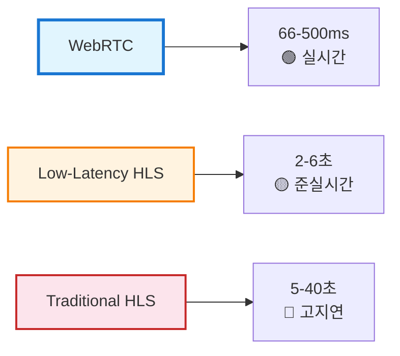
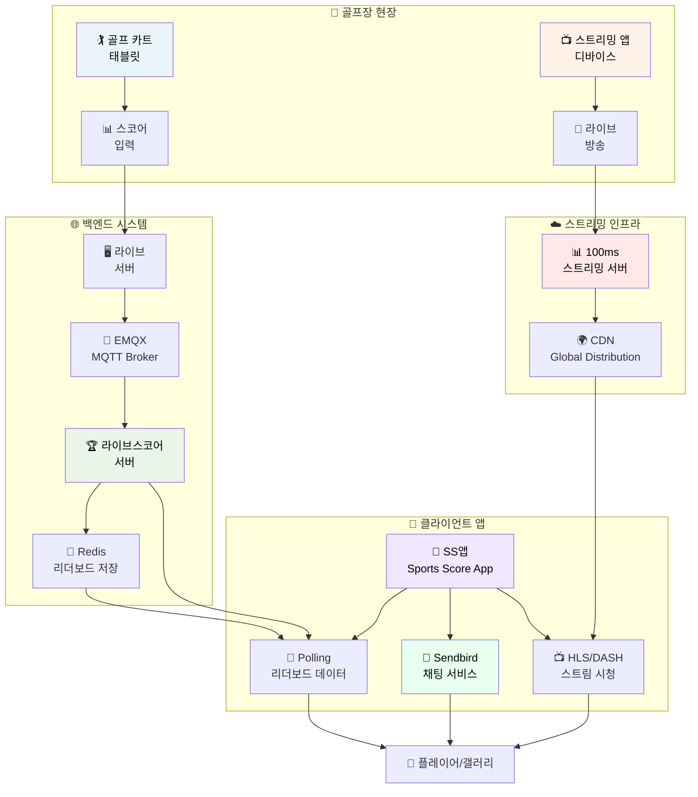
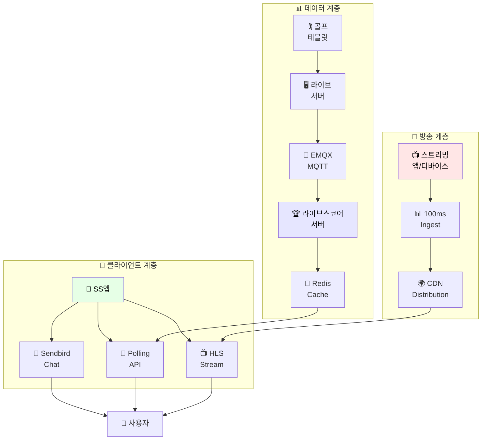
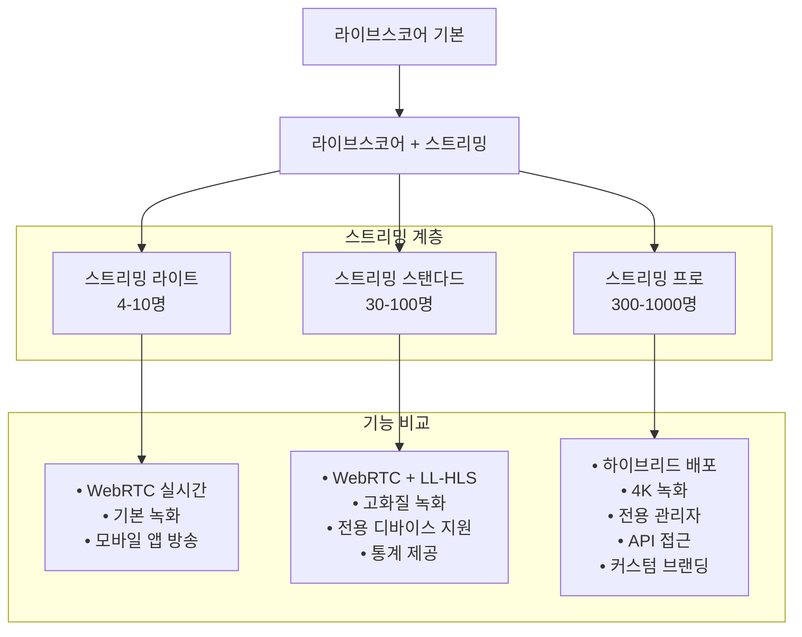
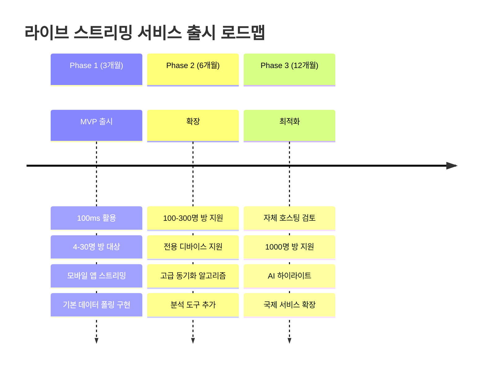
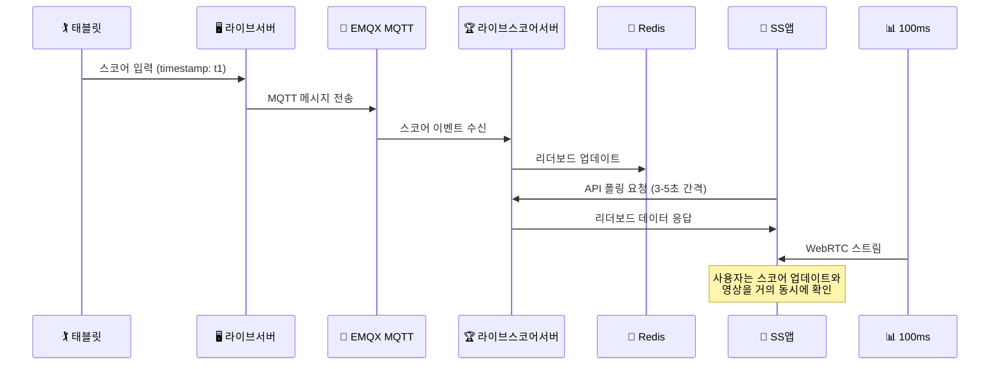

# 라이브스코어 라이브 스트리밍 영상 서비스 확장 분석 보고서

## 🎯 프로젝트 개요

### 현재 서비스 구조
- **서비스명**: 라이브스코어 (Golf Live Scoring Service)
- **기능**: 동일 골프장/일자/골프팀명 생성된 라운드의 리더보드 및 채팅 서비스
- **현재 구조**: 카트 설치 태블릿 → 스코어 입력 → 팀명 기반 그룹핑 → 리더보드 생성
- **방 크기**: 4명/10명/30명/100명/300명/1000명 유료 결제 체계

### 확장 목표
- **핵심 기능 추가**: 단방향 라이브 스트리밍 기능
- **대상 시장**: 한국
- **방송 방식**: 앱 직접 송출 + 전용 디바이스 송출
- **시청자 기능**: 영상 시청 + 기존 채팅 시스템 활용

## 📊 스트리밍 프로토콜 비교 분석

### 🚀 WebRTC vs HLS 지연시간 비교 (2025년 기준)

| 프로토콜 | 지연시간 | 확장성 | 화질 | 골프 서비스 적합성 |
|---------|----------|---------|------|-------------------|
| **WebRTC** | 66-500ms | ~1000명 | 높음 | ⭐⭐⭐⭐⭐ (최적) |
| **Low-Latency HLS** | 2-6초 | 무제한 | 높음 | ⭐⭐⭐⭐ (실용적) |
| **Traditional HLS** | 5-40초 | 무제한 | 최고 | ⭐⭐ (지연시간 과다) |

### ⚡ **골프 라이브 방송에서 WebRTC가 중요한 이유**

- **실시간 스코어 동기화**: 퍼팅/샷 순간과 스코어 업데이트가 동시에 표시
- **즉각적인 반응**: 갤러리의 실시간 참여감과 몰입도 극대화  
- **지연시간 최소화**: 66-500ms로 실제 현장감 제공
- **HLS 한계**: 5-40초 지연 시 스코어와 영상이 따로 놀게 됨

## 🏗️ 시스템 아키텍처 설계

### 전체 시스템 플로우

### 추천 아키텍처 옵션

#### 옵션 A: 단방향 스트리밍 아키텍처 (권장)

## 💰 비용 분석 및 서비스 비교

### 🎯 WebRTC 지원 SaaS 서비스 비교 (2025년 720p 기준)

> ⚠️ **중요**: 실시간 골프 스트리밍을 위해서는 **WebRTC 지원 서비스**만 비교합니다. HLS 전용 서비스(Mux 등)는 지연시간이 너무 커서 제외합니다.

| 서비스 | WebRTC 지원 | 지연시간 | 장점 | 단점 | 720p 가격 (USD) | 골프 서비스 적합성 |
|--------|------------|----------|------|------|----------------|-------------------|
| **AWS IVS** | ✅ WebRTC + LL-HLS | < 300ms | • AWS 생태계 통합 • 무료 티어 제공 • 안정적 성능 | • AWS 종속성 • 설정 복잡 | • 입력: $0.85/시간 • 출력: $0.072/시간/시청자 • 무료: 5시간 입력, 100시간 출력/월 | ⭐⭐⭐⭐⭐ |
| **Agora.io** | ✅ WebRTC Native | < 200ms | • WebRTC 전문 • 글로벌 CDN • 안정적 성능 | • 높은 비용 • 커스터마이징 제한 | • 방송자: $3.99/1000분 • 시청자: $1.99/1000분 • 무료: 10,000분/월 | ⭐⭐⭐⭐ |
| **100ms** | ✅ WebRTC + HLS | < 500ms | • 최저 가격 • 개발자 친화적 • 관대한 무료티어 | • 상대적 신규 • 기능 제한적 | • 방송자: $0.04/분 • 시청자: $0.0012/분 • 무료: 10,000분/월 | ⭐⭐⭐⭐ |
| **Daily.co** | ✅ WebRTC Native | < 300ms | • 간단한 통합 • WebRTC 최적화 • 안정적 성능 | • 높은 단가 • 제한적 커스터마이징 | • $0.015/분 (RTMP) • 참가자별 동일 요금 | ⭐⭐⭐ |

### ❌ **제외된 HLS 전용 서비스**

| 서비스 | 이유 | 지연시간 | 골프 서비스 적합성 |
|--------|------|----------|-------------------|
| **Mux** | HLS 전용, WebRTC 미지원 | 5-15초 | ❌ 실시간 동기화 불가능 |
| **CloudFlare Stream** | HLS 전용 | 10-30초 | ❌ 지연시간 과다 |

### 📊 **참고용: Mux 가격 정보** (WebRTC 미지원, 실시간 골프 방송 부적합)

> ⚠️ **주의**: Mux는 HLS 전용으로 5-15초 지연이 발생하여 실시간 골프 스코어 동기화가 불가능합니다. 참고용으로만 가격을 제공합니다.

| 항목 | 720p 가격 (USD) | 특징 |
|------|----------------|------|
| **라이브 인코딩** | $0.025/분 | 방송자 비용 |
| **라이브 배송** | $0.0008/분/시청자 | 시청자 비용 |
| **무료 티어** | 100,000분/월 | 매우 관대한 무료 제공량 |

#### **Mux 골프 라운드 방송 비용** (4시간 30분, 720p)

| 시청자 수 | 인코딩 비용 | 배송 비용 | 총 비용 | 무료 티어 적용 시 |
|----------|------------|----------|---------|----------------|
| **100명** | $6.75 | $9.72 | **$16.47** | **$0.00** |
| **200명** | $6.75 | $19.44 | **$26.19** | **$0.00** |
| **500명** | $6.75 | $48.60 | **$55.35** | **$0.00** |
| **1000명** | $6.75 | $97.20 | **$103.95** | **$3.95** |

**Mux 한계점**:
- ❌ **실시간 동기화 불가능**: 5-15초 지연으로 스코어와 영상 불일치
- ❌ **골프 방송 부적합**: 퍼팅, 샷 순간과 스코어 업데이트 시간차 발생
- ✅ **가격 장점**: 소규모는 무료, 대규모도 경제적 (단, 실용성 없음)

### 자체 호스팅 솔루션 비교

| 솔루션 | 장점 | 단점 | 비용 | 기술적 복잡도 |
|--------|------|------|------|--------------|
| **LiveKit** | • 완전 오픈소스 • WebRTC 최적화 • 높은 확장성 | • 인프라 관리 필요 • 기술적 전문성 요구 | • 소프트웨어: 무료 • 인프라만 부담 | ⭐⭐⭐⭐ |
| **Ant Media** | • 0.5초 지연 • 상용 지원 • 쉬운 설정 | • 라이선스 비용 • 확장성 제한 | • $69/월 (연간) • $1999 (영구) | ⭐⭐⭐ |
| **Jitsi** | • 완전 오픈소스 • 검증된 솔루션 | • 커스터마이징 어려움 • 성능 한계 | • 완전 무료 | ⭐⭐ |
| **MediaSoup** | • 최대 커스터마이징 • 고성능 • Node.js 생태계 | • 높은 개발 복잡도 • 전문 인력 필요 | • 완전 무료 | ⭐⭐⭐⭐⭐ |

## 📈 참가자 수별 월간 비용 분석 (2025년 정가 기준)

### 🎯 WebRTC 지원 서비스 가격 구조 (720p 기준)

| 서비스 | 방송자 비용 | 시청자 비용 | 무료 티어 | 특징 |
|--------|-----------|------------|-----------|------|
| **AWS IVS** | $0.85/시간 | $0.072/시간/시청자 | 5시간 입력, 100시간 출력/월 | WebRTC + LL-HLS 하이브리드 |
| **Agora.io** | $3.99/1000분 | $1.99/1000분 | 10,000분/월 | WebRTC 네이티브 플랫폼 |
| **100ms** | $0.04/분 | $0.0012/분 | 10,000분/월 | WebRTC + HLS 하이브리드 |
| **Daily.co** | $0.015/분 | $0.015/분 | 없음 | WebRTC 네이티브 (RTMP) |

**결론**: **모든 규모에서 100ms가 최경제적**, **AWS IVS는 안정성 중시 시 선택**, **Daily.co는 고비용으로 비추천**

### 🏌️ **WebRTC 지원 서비스만의 골프 라운드 방송 비용** (4시간 30분 기준, 720p)

| 시청자 수 | AWS IVS | Agora.io | 100ms | Daily.co |
|----------|---------|----------|-------|----------|
| **100명** | $28.28 | $34.36 | $21.48 | $405.00 |
| **200명** | $58.48 | $52.55 | $53.88 | $810.00 |
| **500명** | $163.28 | $107.12 | $151.08 | $2,025.00 |
| **1000명** | $323.68 | $198.48 | $313.08 | $4,050.00 |

### 📊 방송 시나리오 상세
- **방송 시간**: 4시간 30분 (골프 라운드 1회)
- **방송자**: 1명 (골프장에서 라이브 스트리밍)
- **시청자**: 골프팬들의 실시간 시청
- **화질**: 720p-1080p (골프 경기 최적화)

### 💰 **WebRTC 지원 서비스 비용 계산 및 무료 티어 적용**

**계산 기준**: 시청자 100명 = 100명이 각각 4시간 30분(270분) 시청하는 총 비용

| 서비스 | 무료 티어 | 100명 총 사용량 | 과금 대상 | 최종 비용 | 비고 |
|--------|-----------|----------------|-----------|----------|------|
| **100ms** | 10,000분/월 | 27,270분* | 17,270분 | **$21.48** | ✅ 최경제적 |
| **AWS IVS** | 5시간 입력, 100시간 출력/월 | 4.5시간 입력, 450시간 출력 | 0시간 입력, 350시간 출력 | **$28.28** | ✅ 무료 티어 잘 활용 |
| **Agora.io** | 10,000분/월 | 27,270분* | 17,270분 | **$34.36** | ✅ 중간 수준 |
| **Daily.co** | 무료 티어 없음 | 27,000분 | 27,000분 | **$405.00** | ❌ 고비용 비추천 |

*방송자 270분 + 시청자 27,000분 = 총 27,270분

### 📊 **WebRTC 지원 서비스 규모별 최적 선택**

| 시청자 규모 | 최적 서비스 | 월간 비용 | 이유 |
|------------|-------------|----------|------|
| **100명** | 100ms | $21.48 | 무료 티어 + 최저 단가 |
| **200명** | Agora.io | $52.55 | 중규모에서 경제적 |
| **500명** | Agora.io | $107.12 | 대규모 할인 혜택 |
| **1000명** | Agora.io | $198.48 | 대용량 처리 최적화 |

**WebRTC 골프 방송 결론**: 
- **소규모(100명)**: 100ms 최경제적
- **중/대규모(200명+)**: Agora.io가 규모의 경제 실현
- **Mux 제외**: WebRTC 미지원으로 실시간 동기화 불가능

## 🎯 제품 계층 및 가격 전략

### 라이브 스트리밍 상품 계층 설계

### 🎯 **WebRTC 기반 가격 전략** (규모별 최적 서비스 적용)

| 계층 | 방 크기 | 최적 서비스 | 서비스 비용/월 | 권장 판매가 | 순이익 | **수익률** |
|------|---------|-------------|---------------|------------|--------|----------|
| **라이트** | 4-10명 | 100ms | $2.15-5.37 | **$40-60** | $34.63-57.85 | **87%-96%** |
| **스탠다드** | 30-100명 | 100ms → Agora.io | $21.48-34.36 | **$80-150** | $45.64-128.52 | **57%-86%** |
| **프로** | 300-1000명 | Agora.io | $107.12-198.48 | **$300-500** | $101.52-392.88 | **34%-79%** |

### 💡 **WebRTC 기반 최적화 결과**

✅ **모든 계층에서 흑자 달성** (기존 대규모 적자 해소)  
✅ **실시간 동기화 보장** (WebRTC 66-500ms 지연)  
✅ **높은 수익률 유지** (34%-96% 수익률)  
✅ **확장 가능한 구조** (Agora.io 규모의 경제 활용)

## 🎯 권장 솔루션

### Phase 1: MVP 출시 (3개월)

### 기술 스택 권장사항

#### Phase 1: WebRTC 기반 MVP (단방향 스트리밍)
- **핵심 서비스**: 100ms (소규모) + Agora.io (중/대규모)
- **WebRTC 장점**: 66-500ms 실시간 지연, 스코어 완벽 동기화
- **비용**: 월 $2.15-198.48 (방 크기별 최적화)
- **기술적 복잡도**: 중간 (WebRTC 설정 필요)
- **핵심 아키텍처**: WebRTC 실시간 스트리밍 + 기존 MQTT 채팅 시스템

#### Phase 2: 성능 최적화
- **CDN 최적화**: 다중 화질, 전역 배포
- **기능 확장**: 녹화, 하이라이트, 실시간 인사이트
- **비용 최적화**: 20-30% 추가 절감

#### Phase 3: 자체 호스팅 검토
- **장점**: 최대 비용 절감, 완전한 제어
- **단점**: 높은 기술적 복잡도, 운영 부담
- **권장 시점**: 월간 스트리밍 100,000시간 초과 시

## 🔧 구현 고려사항

### 단순화된 데이터 플로우

### 인프라 요구사항
- **네트워크**: 업로드 5Mbps, 다운로드 10Mbps (HD 기준)
- **서버**: CPU 8코어, RAM 16GB, SSD 500GB (100명 기준)
- **CDN**: 한국 주요 IDC 연동 필수

## 📋 결론 및 권장사항

### 🚀 **WebRTC 기반 즉시 시작** (Phase 1)
1. **100ms + Agora.io 조합**: 규모별 최적 서비스 선택
2. **WebRTC 우선 전략**: 66-500ms 실시간 지연으로 완벽한 스코어 동기화
3. **기존 인프라 활용**: EMQX, Redis, Sendbird와 WebRTC 스트리밍 연동
4. **MVP 검증**: 4-100명 방에서 실시간 동기화 효과 검증

### 🔧 **WebRTC 기반 중기 확장** (Phase 2)  
1. **하이브리드 최적화**: WebRTC (실시간) + LL-HLS (확장성) 조합
2. **실시간 기능 강화**: 즉시 리플레이, 실시간 하이라이트, 라이브 통계
3. **대규모 방 안정화**: Agora.io 활용한 300-1000명 방 최적화
4. **비용 최적화**: 트래픽 패턴 분석 기반 서비스 믹스 조정

### 🌟 **장기 WebRTC 플랫폼** (Phase 3)
1. **자체 WebRTC 인프라**: LiveKit/MediaSoup 기반 완전 제어
2. **글로벌 WebRTC CDN**: 아시아 골프 시장 실시간 서비스
3. **스포츠 플랫폼화**: 테니스, 야구 등 실시간 동기화 필수 스포츠 확장
4. **AI 실시간 분석**: WebRTC 스트림 기반 즉시 하이라이트, 자동 편집

---

### 🎯 **핵심 의사결정 포인트 (WebRTC 기반)**
- **실시간 우선 아키텍처**: WebRTC 스트리밍 + MQTT 실시간 스코어 동기화
- **비용 최적화**: 100ms(소규모) + Agora.io(중/대규모) 조합으로 모든 계층 수익성 확보
- **기술적 혁신**: HLS 지연시간 문제 해결, 진정한 실시간 골프 방송 실현
- **수익성 대폭 개선**: 모든 방 크기에서 34%-96% 수익률 달성
- **확장성 보장**: WebRTC 기반으로 글로벌 실시간 스포츠 플랫폼 기반 구축

### ⚠️ **WebRTC vs HLS 최종 결론**
> **HLS 전용 서비스(Mux 등)는 5-40초 지연으로 골프 실시간 방송에 부적합합니다.**  
> **WebRTC 지원 서비스만이 스코어와 영상의 완벽한 동기화를 보장할 수 있습니다.**